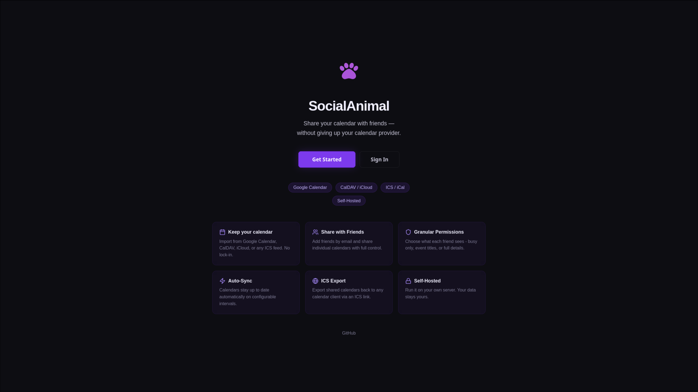
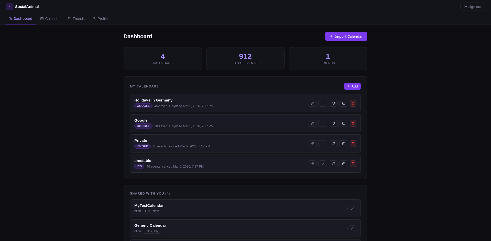
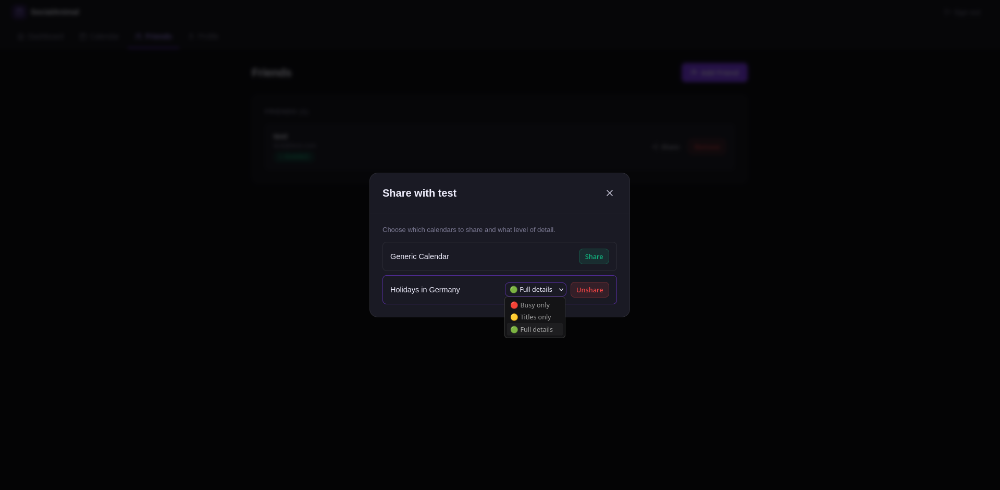
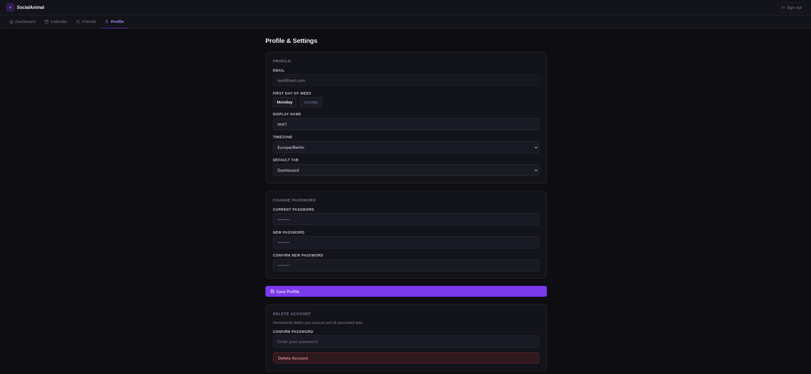
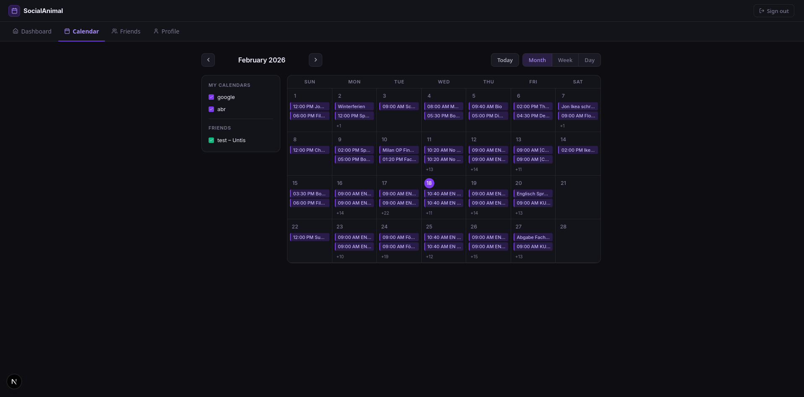

# SocialAnimal 🐾

> Name inspired by _The Social Animal_ by Elliot Aronson - no real psychological correlation, just a fitting name.

SocialAnimal is a **self-hosted social calendar platform** that lets you share your calendar with friends. This is **not** a self-hosted calendar server - tools like [Radicale](https://radicale.org/) do that job well. SocialAnimal sits on top: you and your friends log in, import your existing calendars, and share them with each other - with full control over what they can see.

Friends can view shared calendars directly inside the app, or export them as an ICS link into their own calendar client.

---



---

## Current State - v0.1.0

This is an early release. Current features include:

- **Friend system** - send, accept, and decline friend requests
- **Auth & admin** - login system with admin settings, invite-only or open registration, salted password hashing
- **Google Calendar integration** - easy import for Google calendars
- **ICS/iCal import** - import any calendar feed by URL (Apple, Outlook, Fastmail, etc.)
- **Calendar export** - export shared calendars as ICS links for use in any calendar client
- **Auto-sync** - calendars sync automatically on a configurable interval per calendar
- **Calendar views** - month, week, and day views with side-by-side display of your events and friends' calendars
- **Toggle visibility** - show/hide individual calendars in the sidebar
- **Permission system** - control per-calendar, per-friend what level of detail is shared:
    - 🔴 **Busy only** - time blocks visible, no details
    - 🟡 **Titles only** - event names visible, no description or location
    - 🟢 **Full details** - everything visible
- **Profile & settings** - change password, set default sharing permissions, customize first day of week

|                                    |                                                |
| ---------------------------------- | ---------------------------------------------- |
|  |  |
| _Calendar dashboard_               | _Per-friend sharing controls_                  |
|      |                |
| _Profile settings_                 | _Calendar view_                                |

---

## Roadmap

- [ ] Easy integration for Proton, Apple iCloud, Outlook, and other calendar providers
- [ ] Per-event permission overrides or event exclusions
- [ ] Admin dashboard with user management
- [ ] Per Event Permission system, possibly with regex excludes
- [ ] Comprehensive Unit Tests
- [ ] Calendar color customization
- [ ] Many small improvements...

---

## Setup

### Quick Start

Pull the compose file and example environment:

```bash
curl -O https://raw.githubusercontent.com/NLion74/SocialAnimal/refs/heads/main/docker-compose.yml
curl -O https://raw.githubusercontent.com/NLion74/SocialAnimal/refs/heads/main/example.env

cp example.env .env
```

Edit .env with your configuration:

```bash
GOOGLE_CLIENT_ID=clientid
GOOGLE_CLIENT_SECRET=clientsecret
GOOGLE_REDIRECT_URI=http://localhost:3001/api/import/google/callback

DATABASE_URL="postgresql://postgres:postgres@db:5432/socialanimal"
JWT_SECRET="supersecretkey"
NODE_ENV=production
FRONTEND_PORT=3001
PUBLIC_URL=http://localhost:3001
BACKEND_PORT=4000
```

Start the services:

```bash
docker compose up -d
```

The service will be available at http://localhost:3000

### Google Calendar Setup (Optional)

To enable Google Calendar integration:

1. Go to [Google Cloud Console](https://console.cloud.google.com)
2. Create a new project or select an existing one
3. Enable the Google Calendar API
4. APIs and services → OAuth Consent Screen
5. Under Data access, add scope .../auth/calendar.readonly, then save
6. Go to Clients and create a Client ID of type Web Application
7. Add authorized redirect URI to be your PUBLIC_URL
8. Copy the Client ID and Client Secret to your .env file

Without Google credentials, users can still import calendars via ICS/iCal URL.

## Development

This project is in early development and contributions are very much appreciated! Feel free to open issues, suggest features, or submit pull requests.

### Development Setup

To start a development instance use:

```bash
git clone https://github.com/NLion74/SocialAnimal.git
cd SocialAnimal

# Adjust .env as needed
cp example.env .env

docker compose -f dev-docker-compose.yml up
```

### Testing Production Build

```bash
git clone https://github.com/NLion74/SocialAnimal.git
cd SocialAnimal

# Adjust .env as needed
cp example.env .env.build

docker-compose -f build-docker-compose.yml build --no-cache
docker-compose -f build-docker-compose.yml --env-file .env.build up
```

### Running Tests

```bash
cd backend
npm test

cd ../frontend
npm test
```
