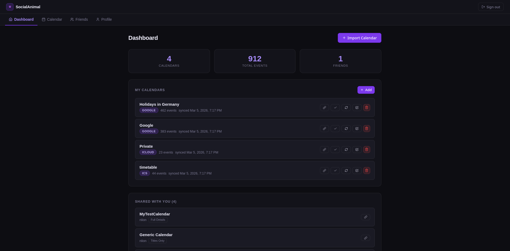
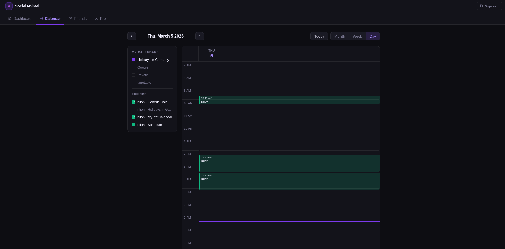
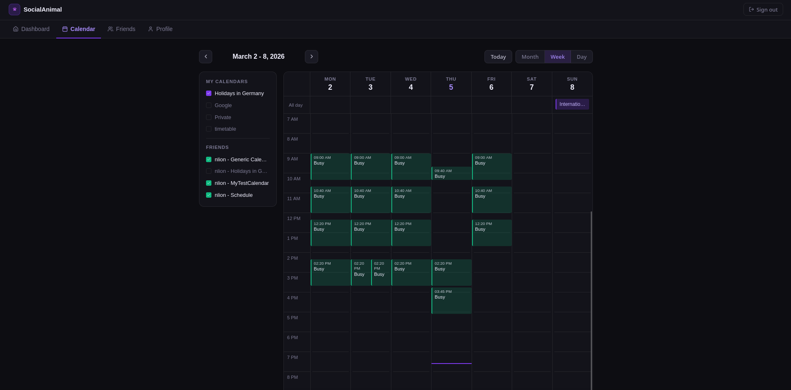
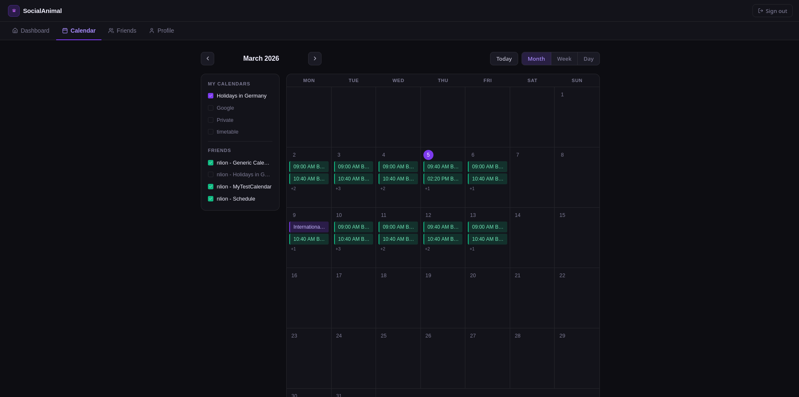
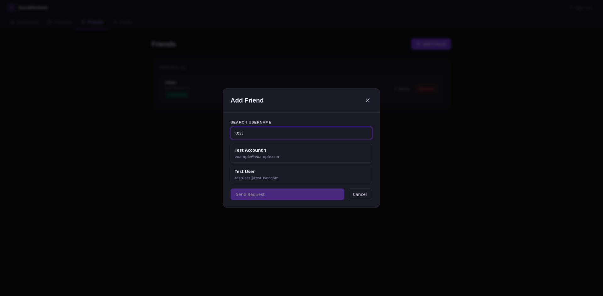
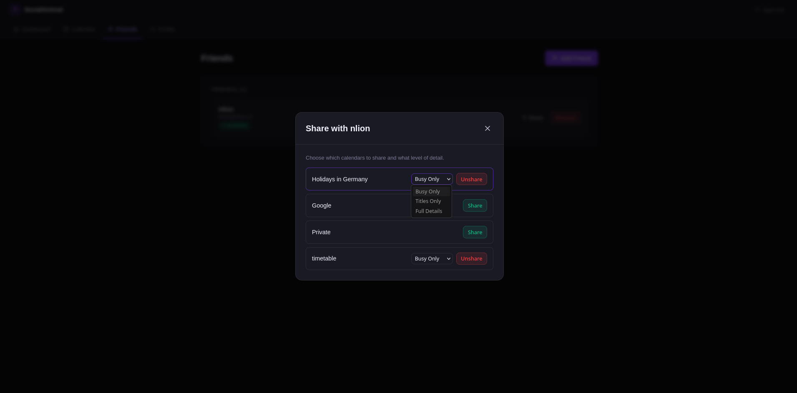
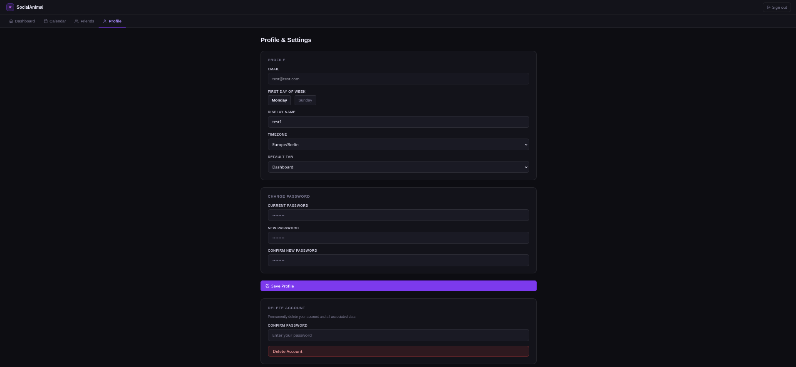
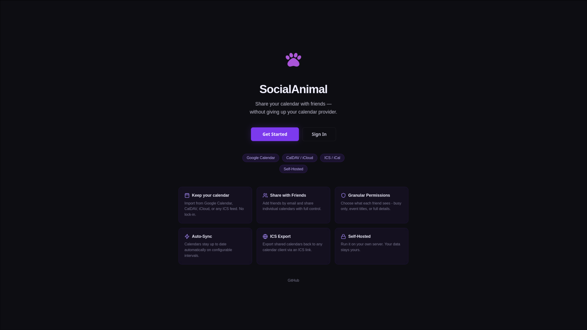

# SocialAnimal 🐾


> Name inspired by _The Social Animal_ by Elliot Aronson - no real psychological correlation, just a fitting name.

SocialAnimal is a **self-hosted social calendar platform** that lets you share your calendar with friends. This is **not** a self-hosted calendar server - tools like [Radicale](https://radicale.org/) do that job well. SocialAnimal sits on top: you and your friends log in, import your existing calendars, and share them with each other - with full control over what they can see.

Friends can view shared calendars directly inside the app, or export them as an ICS link into their own calendar client.

## Try it

A public instance is available at:

https://socialanimal.net

---

## Screenshots

### Dashboard Tab



### Calendar Tab

| Day                          | Week                          | Month                          |
| ---------------------------- | ----------------------------- | ------------------------------ |
|  |  |  |

### Friends Tab

| Friend Request             | Share Menu                       |
| -------------------------- | -------------------------------- |
|  |  |

### Profile Tab



### Landing Page



---

## Why SocialAnimal?

Many proprietary apps act as a social calendar, but often require everyone to use their platform as a calendar provider.

But what if you want to keep using your existing calendar provider and simply share it with others?

SocialAnimal takes a different approach: it connects to your existing calendars and lets you share them with friends, family, or partners.

- View shared events directly in the app or export them back to your own calendar (planned feature - see [Roadmap](#roadmap))
- Fine-grained permissions let you control **exactly what you share, with whom, under which conditions** (planned feature - see [Roadmap](#roadmap))

Besides that SocialAnimal is fully OpenSource, and self-hostable, giving you full control over your data.

## Current Features

**Accounts & Social**

- User authentication and profile settings
- Friend system (requests, accept/decline)

**Calendar Integration**

- Google Calendar import
- CalDAV / iCloud support
- ICS / iCal feed import
- ICS export for external calendar clients

**Calendar Experience**

- Day, week, and month views
- Side-by-side view of your events and friends' calendars
- Toggle individual calendars in the sidebar

**Sharing & Permissions**

- Share calendars with friends
- Per-calendar visibility controls:
    - Busy only
    - Titles only
    - Full event details

**Automation**

- Automatic calendar sync on configurable intervals

## Roadmap

This project is not in a stable version as of yet. Stable release is planned for version v1.0.0.

Major architectural changes, severe bugs, or data loss are to be expected.

What is still planned:

- [ ] Easy integration for Proton, Outlook, Fastmail and possibly more
- [ ] Admin dashboard with user management
- [ ] Improved permission system (intuitive and advanced mode, possibly ABAC)
- [ ] More export types with direct push to calendars
- [ ] Better invite system (multiple codes, shareable invite links)
- [ ] Managing Events directly within the app (Own calendar provider type, would allow shared calendars multiple people can manage)
- [ ] Determine Shared Free Time
- [ ] Calendar color customization
- [ ] Email verification, two-factor authentication, and password reset
- [ ] Internal things like incremental sync, rate limiting...
- [ ] Many more small improvements...

---

## Setup

### Quick Start

Pull the compose file and example environment:

```bash
curl -O https://raw.githubusercontent.com/NLion74/SocialAnimal/refs/heads/main/docker-compose.yml
curl -O https://raw.githubusercontent.com/NLion74/SocialAnimal/refs/heads/main/example.env

cp example.env .env
```

Edit .env with your configuration:

```bash
# See Google Calendar Setup below
GOOGLE_CLIENT_ID=clientid
GOOGLE_CLIENT_SECRET=clientsecret
GOOGLE_REDIRECT_URI=http://localhost:3000/api/providers/google/callback

DATABASE_URL="postgresql://postgres:postgres@db:5432/socialanimal"
JWT_SECRET="supersecretkey"
NODE_ENV=production
FRONTEND_PORT=3000
PUBLIC_URL=http://localhost:3000
BACKEND_PORT=4000
```

Start the services:

```bash
docker compose up -d
```

The service will be available at http://localhost:3000

### Google Calendar Setup (Optional)

To enable Google Calendar integration:

1. Go to [Google Cloud Console](https://console.cloud.google.com)
2. Create a new project or select an existing one
3. Enable the Google Calendar API
4. APIs and services → OAuth Consent Screen
5. Under Data access, add scope .../auth/calendar.readonly, then save
6. Go to Clients and create a Client ID of type Web Application
7. Add authorized redirect URI: `https://your-public-url/api/providers/google/callback`
8. Copy the Client ID and Client Secret to your .env file

Without Google credentials, users can still import calendars via ICS/iCal URL.

## Development

This project is in early development and contributions are very much appreciated! For larger architectural changes or if you're unsure feel free to open an issue. Otherwise you may open a PR directly for smaller fixes, or even something larger but don't be disappointed if without further discussion in an issue your changes may not be merged

### Documentation

#### Tech Stack

- **Frontend:** Next JS, React, TypeScript
- **Backend:** Node JS, Fastify, TypeScript
- **Database:** PostgreSQL
- **ORM:** Prisma
- **Testing:** Vitest
- **Containerization:** Docker, Docker Compose

#### Backend API

The backend API structure shown below **may be out of date** - check the latest snapshot [here](https://raw.githubusercontent.com/NLion74/SocialAnimal/refs/heads/main/backend/tests/__snapshots__/app.test.ts.snap).

Base routes:

- `GET /health`

Users (`/api/users`):

- `POST /register`
- `POST /login`
- `GET /public-settings`
- `GET /me`
- `PUT /me`
- `DELETE /me`
- `GET /app-settings` (admin)
- `PUT /app-settings` (admin)
- `POST /invite` (admin)

Calendars (`/api/calendars`):

- `GET /`
- `PUT /:id`
- `DELETE /:id`
- `POST /:id/sync`
- `GET /:id/test`

Events (`/api/events`):

- `GET /`
- `GET /friends`

Friends (`/api/friends`):

- `GET /`
- `POST /request`
- `POST /:id/accept`
- `DELETE /:id`
- `POST /share-calendar`

Providers:

- `POST /api/providers/:type/import`
- `GET /api/providers/:type/export/:calendarId`
- `POST /api/providers/:type/test`
- `GET /api/providers/:type/discover`
- `POST /api/providers/:type/discover`
- `GET /api/providers/google/auth-url`
- `GET /api/providers/google/callback`

#### Architecture

The backend follows a route - service - data/utils structure.

Core backend areas:

- Calendar providers
- User auth and settings management
- Calendars and events
- Friends

Providers use a capability based handler. They implement traits like:

- importable
- syncable
- discoverable
- testable
- exportable

This allows providers to implement only features they allow.

Layer separation:

1. **Routes** - HTTP layer
2. **Services** - business logic
3. **Data & utilities** - DB persistence, auth, permission and helper logic

Frontend architecture:

- Provides a main layout and authentication routes
- Once authenticated, users interact with the protected layout and app pages
- Handles rendering of calendars, events, and friend-sharing controls from backend

### Development Setup

To start a development instance use:

```bash
git clone https://github.com/NLion74/SocialAnimal.git
cd SocialAnimal

# Adjust .env as needed
cp example.env .env

docker compose -f dev-docker-compose.yml up
```

### Testing Production Build

```bash
git clone https://github.com/NLion74/SocialAnimal.git
cd SocialAnimal

# Adjust .env as needed
cp example.env .env.build

docker compose -f build-docker-compose.yml build --no-cache
docker compose -f build-docker-compose.yml --env-file .env.build up
```

### Running Tests

```bash
cd backend
npm test

cd ../frontend
npm test
```
