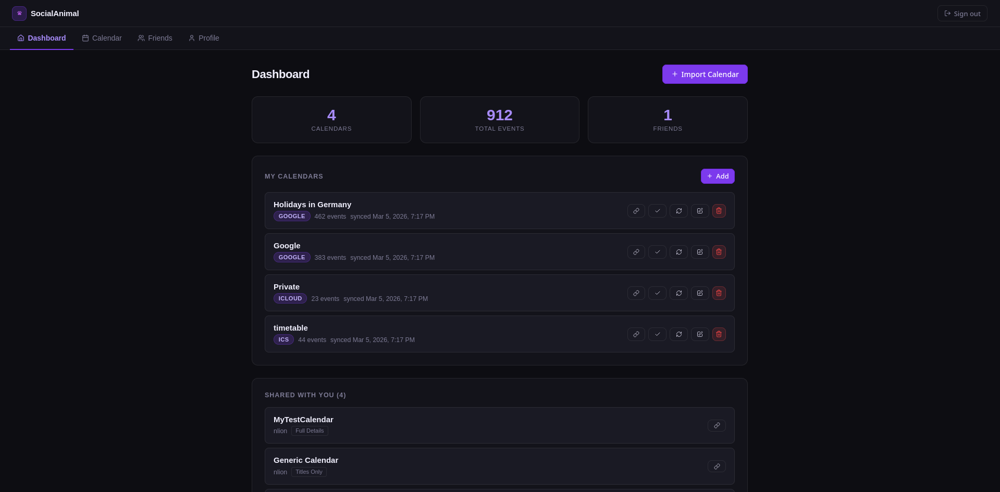
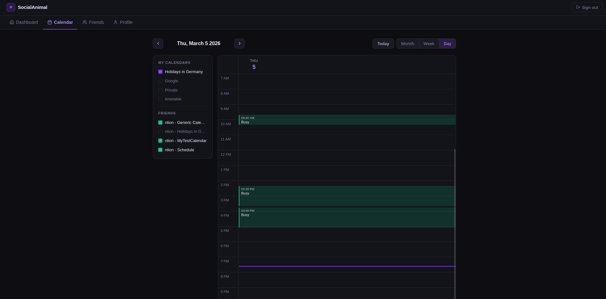
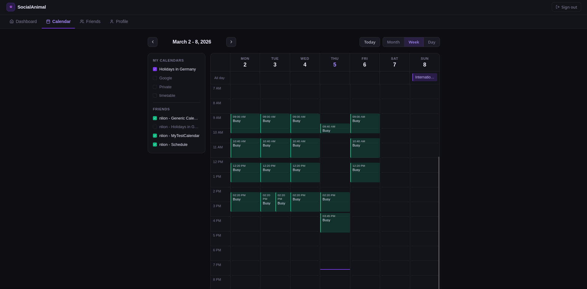
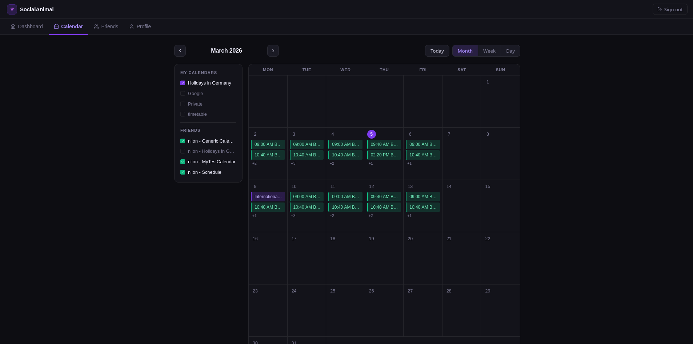
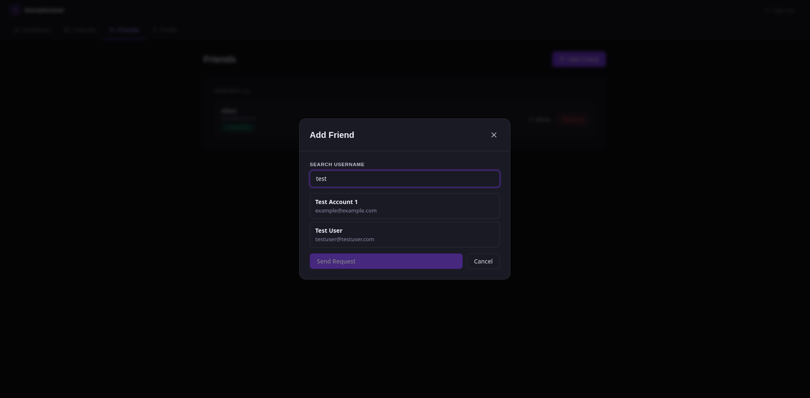
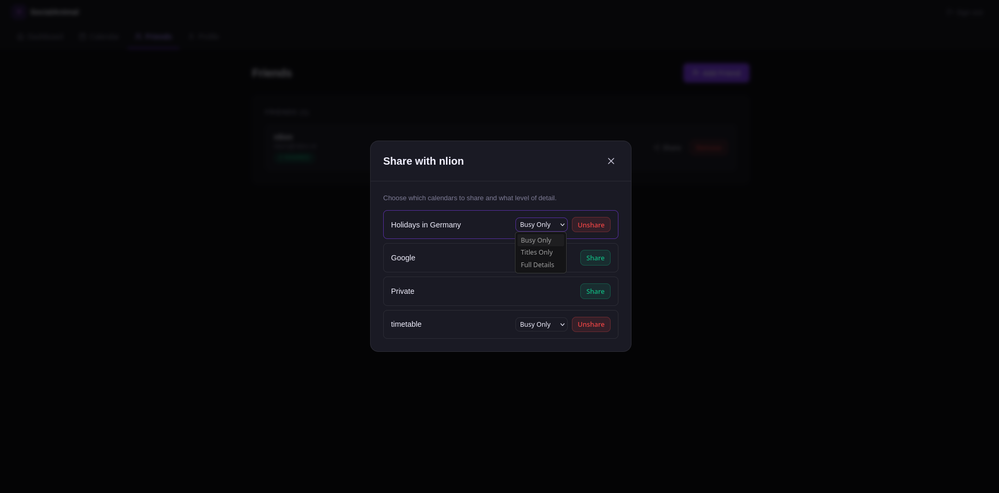
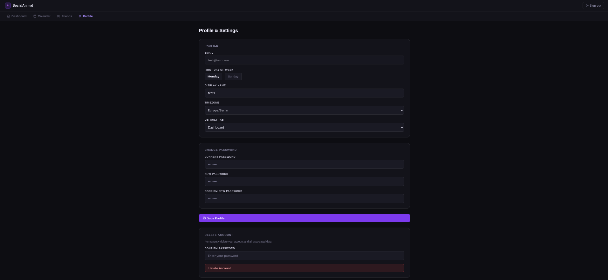
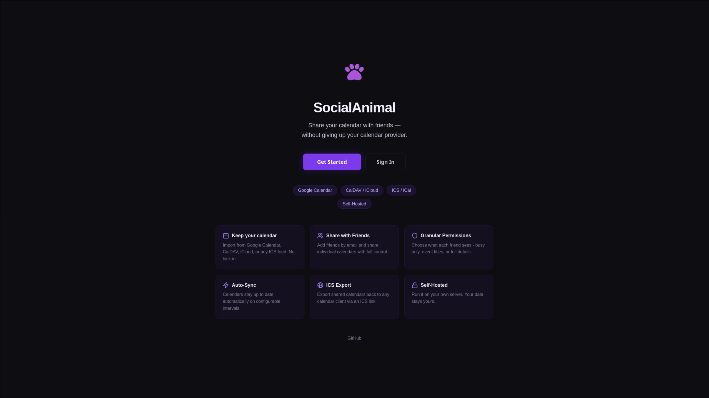

# SocialAnimal 🐾


> Name inspired by _The Social Animal_ by Elliot Aronson - no real psychological correlation, just a fitting name.

SocialAnimal is a **self-hosted social calendar platform** that lets you share your calendar with friends. This is **not** a self-hosted calendar server - tools like [Radicale](https://radicale.org/) do that job well. SocialAnimal sits on top: you and your friends log in, import your existing calendars, and share them with each other - with full control over what they can see.

Friends can view shared calendars directly inside the app, or export them as an ICS link into their own calendar client.

## Try it

A public instance is available at:

https://socialanimal.net

---

## Screenshots

### Dashboard Tab



### Calendar Tab

| Day                          | Week                          | Month                          |
| ---------------------------- | ----------------------------- | ------------------------------ |
|  |  |  |

### Friends Tab

| Friend Request             | Share Menu                       |
| -------------------------- | -------------------------------- |
|  |  |

### Profile Tab



### Landing Page



---

## Why SocialAnimal?

Many proprietary apps act as a social calendar, but usually require everyone to use their platform as a calendar provider.

But what if you want to keep using your existing calendar provider and simply share it with others?

SocialAnimal takes a different approach: it connects to your existing calendars and lets you share them with friends, family, or partners.

- View shared events directly in the app or subscribe to them in your own calendar
- Rulesets control what you share, with whom, and under which conditions.

## Current Features

**Accounts & Social**

- Password sign-in, optional email verification, password recovery, and profile settings
- Two-factor authentication using email codes or an authenticator app, with recovery codes
- Administrator-enforced verification and 2FA with restricted setup access
- Admin UI with account roles, calendar limits, sync windows, default preferences, statistics, synchronization logs, and email job history
- Administrator account deletion, password reset emails, and two-factor recovery
- Multiple single-use invitations with expiry, revocation, and registration links
- Editable sharing rulesets with simple and expert editors, plus list/calendar previews explaining which rules matched
- Friend system (requests, accept/decline)

**Calendar Integration**

- Google Calendar import
- CalDAV / iCloud support
- ICS / iCal feed import
- ICS export for external calendar clients
- Multiple named sharing links with independent rulesets, optional expiration, and revocable calendar previews for people without an account

**Calendar Experience**

- Day, week, and month views
- Side-by-side view of your events and friends' calendars
- Toggle individual calendars in the sidebar

**Sharing & Permissions**

- Share calendars with friends, with optional expiration per grant
- Per-calendar visibility controls:
    - Hidden
    - Busy only
    - Titles only
    - Full event details
- Rules can combine calendar, friend, event, and owner-timezone date/time attributes
- Event conditions include description, location/description presence, and recurrence
- Public previews offer list and calendar views; rule explanations remain private to the owner

**Automation**

- Automatic calendar sync on configurable intervals

## Roadmap

This project is not in a stable version as of yet. Stable release is planned for version v1.0.0.

Major architectural changes, severe bugs, or data loss are to be expected.

What is still planned:

- [ ] Easy integration for Proton, Outlook, Fastmail and possibly more
- [ ] More export types with direct push to calendars
- [ ] Default calendar sharing state for new friends
- [ ] Managing Events directly within the app (Own calendar provider type, would allow shared calendars multiple people can manage)
- [ ] Determine Shared Free Time
- [ ] Profile avatars and Calendar color customization
- [ ] Incremental provider synchronization
- [ ] Many more small improvements...

---

## Setup

### Quick Start

Pull the compose file and example environment:

```bash
curl -O https://raw.githubusercontent.com/NLion74/SocialAnimal/refs/heads/main/docker-compose.yml
curl -O https://raw.githubusercontent.com/NLion74/SocialAnimal/refs/heads/main/example.env

cp example.env .env
```

Edit .env with your configuration:

```bash
# See Google Calendar Setup below
GOOGLE_CLIENT_ID=clientid
GOOGLE_CLIENT_SECRET=clientsecret
GOOGLE_REDIRECT_URI=http://localhost:3000/api/v1/connections/google/callback

POSTGRES_PASSWORD="generate-with-openssl-rand-hex-32"
DATABASE_URL="postgresql://postgres:${POSTGRES_PASSWORD}@db:5432/socialanimal"
JWT_SECRET="replace-with-a-random-secret"
CREDENTIAL_ENCRYPTION_KEY="generate-with-openssl-rand-hex-32-and-back-up"
SOCIALANIMAL_VERSION="your-published-release-tag"
NODE_ENV=production
FRONTEND_PORT=3000
PUBLIC_URL=http://localhost:3000
BACKEND_PORT=4000
```

Start the services:

```bash
docker compose up -d
```

The service will be available at `PUBLIC_URL`. Set `FRONTEND_PORT` to choose its host port. Containers use fixed internal ports; only the frontend is exposed in production. Keep the database password and encryption key stable when reusing a database.

### Google Calendar Setup (Optional)

To enable Google Calendar integration:

1. Go to [Google Cloud Console](https://console.cloud.google.com)
2. Create a new project or select an existing one
3. Enable the Google Calendar API
4. APIs and services → OAuth Consent Screen
5. Under Data access, add scope .../auth/calendar.readonly, then save
6. Go to Clients and create a Client ID of type Web Application
7. Add authorized redirect URI: `https://your-public-url/api/v1/connections/google/callback`
8. Copy the Client ID and Client Secret to your .env file

Without Google credentials, users can still connect Apple Calendar (iCloud), CalDAV, or an ICS/iCal URL. For a calendar server on your private network, add its exact hostname or IP to `PRIVATE_PROVIDER_HOSTS` in your environment file. Other private network addresses are blocked.

## Development

This project is in early development and contributions are very much appreciated! For larger architectural changes or if you're unsure feel free to open an issue. Otherwise you may open a PR directly for smaller fixes, or even something larger but don't be disappointed if without further discussion in an issue your changes may not be merged

### Documentation

#### Tech Stack

- **Frontend:** Next JS, React, TypeScript
- **Backend:** Node JS, Fastify, TypeScript
- **Database:** PostgreSQL
- **ORM:** Prisma
- **Testing:** Vitest
- **Containerization:** Docker, Docker Compose

#### Backend API

The backend is a modular monolith with feature modules and shared `core/` infrastructure. The frontend uses feature screens and a generated TypeScript API client. API routes live under `/api/v1`; [OpenAPI](docs/openapi.json) describes their contracts. Shared ICS subscriptions use opaque, revocable tokens rather than account credentials.

### Development Setup

To start a development instance use:

```bash
git clone https://github.com/NLion74/SocialAnimal.git
cd SocialAnimal

# Fill in POSTGRES_PASSWORD, JWT_SECRET and CREDENTIAL_ENCRYPTION_KEY.
cp example.env .env

node scripts/validate-compose.mjs development .env
docker compose --env-file .env -f dev-docker-compose.yml up --wait
```

Development uses source mounts, dependency/cache volumes, and live reload. It always runs with `NODE_ENV=development`; `BACKEND_PORT` and `DB_PORT` select host ports. To reuse an existing development database, retain its current PostgreSQL credentials and set `DEV_DATABASE_VOLUME` to its existing Docker volume name.

Follow backend logs with `docker compose -f dev-docker-compose.yml logs -f backend`. The backend writes structured startup, request, synchronization, and email-delivery logs to stdout. `LOG_LEVEL` defaults to `info`; use `debug` to include successful health checks. Request logs use route templates and omit credentials, query strings, and email contents. Recreate the backend container after changing environment settings.

### Testing Production Build

```bash
git clone https://github.com/NLion74/SocialAnimal.git
cd SocialAnimal

# Configure secrets, PUBLIC_URL and SOCIALANIMAL_VERSION=local.
cp example.env .env.build

node scripts/validate-compose.mjs build .env.build
docker compose --env-file .env.build -f build-docker-compose.yml up --build --wait
```

Build Compose runs the production Dockerfiles without source mounts and uses its own `socialanimal-build` project. Choose a different `FRONTEND_PORT` and matching `PUBLIC_URL` in `.env.build` when development is also running. Always pass `--env-file .env.build` to build-stack commands.

`docker-compose.yml` pulls the published images tagged by `SOCIALANIMAL_VERSION`; it does not build source. `legacy-docker-compose.yml` is a compatibility filename for the same production services. Additional instances need a unique `-p NAME`, host ports, and `DATABASE_VOLUME` (or `DEV_DATABASE_VOLUME` for development). Build and production use separate database volumes by default; set `DATABASE_VOLUME` explicitly to reuse a database between them.

### Running Tests

```bash
cd backend
npm test

cd ../frontend
npm test
```

Backend integration tests use a disposable PostgreSQL database named with an `_test` suffix via `TEST_DATABASE_URL`. Browser coverage uses Playwright with Firefox. Tests are kept outside application source directories.

### Password recovery

Configure the SMTP settings in `example.env` to enable verification and password reset emails. Users can request a link from **Forgot password**; administrators can use **Send password reset email** when managing an account. The user chooses their password. Links expire after 30 minutes, and changing a password signs out existing sessions. Email delivery is queued and retried; the UI confirms the request, not delivery.

`PUBLIC_URL` must be the externally reachable application origin. Keep `CREDENTIAL_ENCRYPTION_KEY` backed up: provider credentials, authenticator secrets, and queued email payloads depend on it. `CORS_ORIGINS` optionally allows additional browser origins. Only set `TRUSTED_PROXY_CIDRS` to proxy addresses you control; when empty, forwarded client IPs are ignored and clients behind a proxy share its request limits. Configure external access logs to omit feed tokens and OAuth callback query strings.

### Email verification and two-factor authentication

Configure SMTP using `example.env`. Unverified users always see a verification notice and resend action on their profile, even when verification is optional. Requests are queued; the administration page shows delivery attempts, retries, and failures. “Sent” means the SMTP server accepted the email. Completed email logs are kept for 30 days and can be cleared without cancelling pending deliveries.

A user can enable one second factor: email codes sent to their verified address, or an authenticator app using a setup key. Recovery codes are displayed once after enrollment; store them privately. Changing methods requires a recent sign-in and confirmation of the new method. Password recovery does not disable two-factor authentication.

Administrators can require two-factor authentication. New and unverified users must verify email before accessing the app. Verified users without a factor receive email authentication automatically; existing authenticator settings remain active. Administrators can reset another user's factor, which ends existing sessions and requires verification and setup again. At least one active administrator must remain when deleting or disabling accounts.

### Sharing rules and expiration

Each friend calendar grant selects an editable ruleset. Rules are evaluated in priority order; the first match determines full details, titles, busy, or hidden visibility, otherwise the ruleset fallback applies. AND, OR, and NOT groups can combine conditions. Date and time conditions match any overlap with the specified window in the calendar owner's timezone.

Both friend grants and public sharing links can expire. Access is checked on each request, including ICS subscriptions. Multiple links can coexist with separate names, rulesets, and expiration dates. Revoked links can be permanently removed. Owner previews explain the matching rule and show hidden events for diagnosis; public previews never expose those explanations or hidden events.
